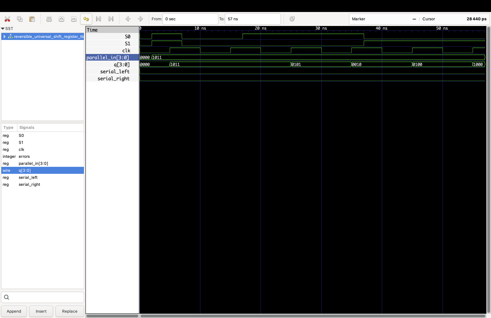

# Optimized Shift Register Design Using Reversible Logic

A Verilog HDL implementation and functional verification of reversible sequential circuits based on the architecture described in **"Optimized Shift Register Design Using Reversible Logic."**

This project implements a Sayem-gate-based reversible storage architecture and uses it to construct and verify 4-bit shift-register designs.

## Project Overview

Reversible logic is a digital logic approach in which the input vector can be uniquely reconstructed from the output vector. Reversible circuits are studied for applications involving low-power and energy-efficient computation.

This implementation includes:

- 4-bit Serial-In Serial-Out (SISO) shift register
- 4-bit Serial-In Parallel-Out (SIPO) shift register
- 4-bit Parallel-In Serial-Out (PISO) shift register
- 4-bit Universal Shift Register

The design is developed hierarchically from the reversible Sayem gate to the D latch, D flip-flop, and shift-register architectures.

## Design Hierarchy

```text
                 Sayem Reversible Gate
                          |
                          v
                Reversible D Latch
                          |
                          v
             Master-Slave Reversible DFF
                          |
             +------------+------------+
             |            |            |
             v            v            v
           SISO         SIPO         PISO
             |
             v
     Universal Shift Register
```

## Sayem Reversible Gate

The project begins with a 4x4 Sayem reversible gate.

The gate accepts four inputs:

```text
A, B, C, D
```

and produces four outputs:

```text
P, Q, R, S
```

Implementation:

```text
rtl/sayem_gate.v
```

The gate was exhaustively verified using all 16 possible 4-bit input combinations.

Verification result:

```text
PASS: All 16 input combinations produce
      unique output combinations.

PASS: Sayem gate is reversible.
```

## Reversible D Latch

A reversible D latch is implemented using the Sayem-gate-based logic.

Implementation:

```text
rtl/reversible_d_latch.v
```

The testbench verifies transparent operation, data capture, and hold behavior.

Verification result:

```text
PASS: All D latch tests passed.
```

## Reversible D Flip-Flop

The reversible D flip-flop is implemented using a master-slave arrangement of two reversible D latches.

Implementation:

```text
rtl/reversible_dff.v
```

The design was verified for:

- Initial state
- D = 0
- D = 1
- Data hold
- Clock-edge operation
- Consecutive data transitions

Verification result:

```text
PASS: Reversible D flip-flop verified.
PASS: Master-slave operation is correct.
```

## 4-bit SISO Shift Register

The Serial-In Serial-Out shift register consists of four reversible D flip-flops connected in a chain.

```text
Serial In
    |
    v
  +-----+    +-----+    +-----+    +-----+
  | DFF | -> | DFF | -> | DFF | -> | DFF |
  +-----+    +-----+    +-----+    +-----+
                                      |
                                      v
                                  Serial Out
```

Implementation:

```text
rtl/reversible_siso.v
```

Verification result:

```text
PASS: All SISO shift tests passed.
```

## 4-bit SIPO Shift Register

The Serial-In Parallel-Out shift register accepts serial input data and provides the stored register contents as parallel outputs.

Implementation:

```text
rtl/reversible_sipo.v
```

Verification result:

```text
PASS: All SIPO shift tests passed.
```

## 4-bit PISO Shift Register

The Parallel-In Serial-Out shift register supports two main operations:

```text
Enable = 1  -> Parallel Load
Enable = 0  -> Shift
```

The testbench loads:

```text
1011
```

and verifies the following shift sequence:

```text
1011 -> 0101 -> 0010 -> 0001 -> 0000
```

Implementation:

```text
rtl/reversible_piso.v
```

Verification result:

```text
PASS: All PISO tests passed.
```

## 4-bit Universal Shift Register

The Universal Shift Register combines multiple register operations into a single design.

| S1 | S0 | Operation |
|----|----|-----------|
| 0  | 0  | Hold |
| 0  | 1  | Shift Right |
| 1  | 0  | Shift Left |
| 1  | 1  | Parallel Load |

Implementation:

```text
rtl/reversible_universal_shift_register.v
```

The design was functionally verified for:

- Hold
- Parallel load
- Shift right
- Shift left

Example verification sequence:

```text
Initial        0000
Parallel Load  1011
Hold           1011
Shift Right    0101
Shift Right    0010
Shift Left     0100
Shift Left     1000
```

Verification result:

```text
PASS: All Universal Shift Register tests passed.
PASS: Hold, parallel load, shift right, and shift left verified.
```

## Verification

Each major design block has a dedicated Verilog testbench.

```text
tb/
├── sayem_gate_tb.v
├── reversible_d_latch_tb.v
├── reversible_dff_tb.v
├── reversible_siso_tb.v
├── reversible_sipo_tb.v
├── reversible_piso_tb.v
└── reversible_universal_shift_register_tb.v
```

### Verification Summary

| Design | Verification |
|---|---|
| Sayem Reversible Gate | PASS |
| Reversible D Latch | PASS |
| Reversible D Flip-Flop | PASS |
| 4-bit SISO | PASS |
| 4-bit SIPO | PASS |
| 4-bit PISO | PASS |
| 4-bit Universal Shift Register | PASS |

## Waveform

The Universal Shift Register was simulated using Icarus Verilog and inspected using GTKWave.

The waveform demonstrates the clock, select signals, parallel input, register output, and serial inputs during the verification sequence.



## Tools Used

- Verilog HDL
- Icarus Verilog
- GTKWave
- Visual Studio Code
- Git
- GitHub

## Running the Simulation

### Compile the Universal Shift Register

```bash
iverilog -g2012 \
-o simulation/reversible_universal_shift_register_sim \
rtl/sayem_gate.v \
rtl/reversible_d_latch.v \
rtl/reversible_dff.v \
rtl/reversible_universal_shift_register.v \
tb/reversible_universal_shift_register_tb.v
```

### Run the simulation

```bash
vvp simulation/reversible_universal_shift_register_sim
```

### View the waveform

```bash
gtkwave simulation/universal_shift_register.vcd
```

The generated simulation files are excluded from Git tracking using `.gitignore`.

## Project Structure

```text
optimized-reversible-shift-register/
│
├── rtl/
│   ├── sayem_gate.v
│   ├── reversible_d_latch.v
│   ├── reversible_dff.v
│   ├── reversible_siso.v
│   ├── reversible_sipo.v
│   ├── reversible_piso.v
│   └── reversible_universal_shift_register.v
│
├── tb/
│   ├── sayem_gate_tb.v
│   ├── reversible_d_latch_tb.v
│   ├── reversible_dff_tb.v
│   ├── reversible_siso_tb.v
│   ├── reversible_sipo_tb.v
│   ├── reversible_piso_tb.v
│   └── reversible_universal_shift_register_tb.v
│
├── screenshots/
│   └── universal_shift_register_waveform.png
│
├── simulation/
│   └── Generated simulation files
│
├── .gitignore
└── README.md
```

## Reference

The project is based on the architecture described in:

**Optimized Shift Register Design Using Reversible Logic**

The referenced work describes a Sayem-gate-based reversible edge-triggered D flip-flop and its application to reversible shift-register architectures.

## Scope

This repository contains a **Verilog HDL functional implementation and simulation** of the reversible architectures.

It does not claim to reproduce the original transistor-level Cadence implementation, physical design, or reported power measurements.
EOF

git add README.md
git commit -m "Add project documentation"
git push

